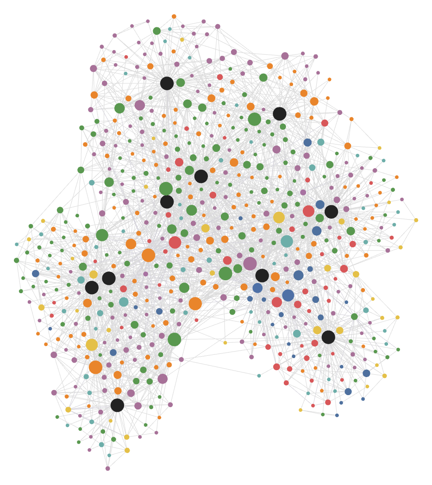

# domaingraph

Domain-aware multimodal knowledge graph: Whisper -> Neo4j -> hybrid search, with an MCP server and Obsidian export.

**Question this project answers:** How can an agent keep structured, domain-aware, multimodal long-term knowledge, and does a graph beat vector-only search?

Part of the local AI agent ecosystem; see `../ROADMAP.md`.

## D1: ingest pipeline

Turns lectures and documents into timestamped (or page/heading-tagged) chunks of ~200 words.

```powershell
uv sync --extra gpu                     # CUDA 12 libraries for faster-whisper on an NVIDIA GPU
domaingraph ingest lecture.mp4 notes/   # video, audio, .txt, .md, .pdf; folders are walked
domaingraph sources                     # what's ingested
domaingraph show <source-id>            # its chunks
domaingraph wer <source-id> ref.txt     # word error rate against a reference transcript
```

- **Video / audio:** ffmpeg decodes to 16 kHz mono, then faster-whisper (`large-v3-turbo`, VAD on, beam 5) produces timestamped segments. ffmpeg must be on PATH (`winget install Gyan.FFmpeg`).
- **Documents:** text and Markdown split into paragraphs (Markdown keeps its heading path), PDF keeps page numbers.
- **Chunking:** segments/paragraphs are packed into ~200-word chunks (max 300) with a 40-word overlap; each chunk keeps its time range, page range or heading.
- **Idempotent:** sources are keyed by content hash, so the same file is skipped even if renamed. `--force` re-chunks from the saved transcript instead of transcribing again.
- Output goes to `data/sources/<id>/` (`source.json`, `transcript.json`, `chunks.jsonl`); `data/` is git-ignored.

**Real-lecture result** (RTX 5060 Ti 16 GB, CUDA float16): MIT 6.006 Fall 2011, Lecture 6 "AVL Trees, AVL Sort" ([YouTube](https://www.youtube.com/watch?v=FNeL18KsWPc), CC BY-NC-SA).

| Audio | Transcription time | Speed | Chunks | WER vs MIT's human captions |
|---|---|---|---|---|
| 51:58 | 58.8 s | 53x realtime | 43 | 6.1% (97 sub, 230 del, 105 ins / 7,059 words) |

Most errors are deletions: the human captions keep repeated words and false starts that Whisper drops. WER normalizes case, punctuation and digits (`6` vs `six`); caption sound tags like `[LAUGHTER]` were removed from the reference.

## D2: knowledge extraction

A local LLM (through Ollama) reads each chunk and returns concepts, relations and facts as JSON constrained to a Pydantic schema. Duplicate concepts are then merged across chunks and sources.

```powershell
ollama pull qwen3:8b; ollama pull bge-m3
domaingraph extract --model qwen3:8b            # all sources; resumes, retries failed chunks
domaingraph concepts --model qwen3:8b --limit 20
domaingraph eval-extract --models qwen3:8b,qwen3:14b --min-chunks 1,2
domaingraph eval-extract --models qwen3:8b --sweep 0.75,0.85,0.9   # merge thresholds
```

- **Extraction** (`extraction.py`): one call per chunk, temperature 0, with the reply constrained by Ollama's `format` to a JSON schema. That schema caps a chunk at 12 concepts, 12 relations and 8 facts.
  - Concepts have a name, aliases, a type, a one-line definition and a confidence score.
  - Relations use 6 predicates: `is_a`, `part_of`, `uses`, `solves`, `has_property`, `contrasts_with`.
  - Facts are self-contained claims, linked to the concepts they involve.
  - Each prompt lists the concept names earlier chunks used, so the same idea keeps the same name.
  - Every item keeps a pointer back to its chunk and time range.
  - Output goes to `data/extractions/<source>/<model>.jsonl`, written after each chunk, so an interrupted run resumes.
- **Merging** (`merge.py`), in two passes:
  1. Normalized names (case, hyphens, spaces, articles, plurals, "operation"), plus "this name is another concept's alias", e.g. `BST` -> `binary search tree`.
  2. bge-m3 similarity of names, at >= 0.85 by default and only between concepts of the same type. A contrast guard blocks look-alike pairs with different meanings, such as `left rotate` / `right rotate` or `binary tree` / `binary search tree`.

  The merged result is written to `data/knowledge/<model>.json`. Every concept, relation and fact keeps all its mentions, with chunk, time range and confidence.
- **Evaluation** (`evaluate_extraction.py`): the extracted concepts and relations are compared with gold sets in `benchmarks/extraction/gold/`. It also measures pairwise merge quality.

**Result:** gold sets for 3 lectures (MIT 6.006 Lectures 5-7): 82 concepts and 80 relations. Strict name/alias matching:

| Model | Concepts P / R | Core concepts R | Relations P / R | Rel P, ends in gold |
|---|---|---|---|---|
| qwen3:8b | 28% / 87% | 95% | 6% / 51% | 20% |
| qwen3:14b | 23% / 88% | 93% | 5% / 41% | 20% |
| llama3.1:8b | 30% / 16% | 26% | 12% / 4% | 3 of 4 |

- **Recall is high, precision is low.** The extractor finds almost every concept the lecture teaches, but also lists generic words (`node`, `pointer`) and minor real ones the gold set leaves out.
- **Relations are the weakest part.** Only about 1 in 5 relations between two gold concepts is right; the rest have the wrong predicate or direction.
- **The model's confidence carries no signal:** 96% of mentions are scored 0.9.
- **qwen3:8b beats qwen3:14b here**, because 14b lists more concepts at the same recall.
- **llama3.1:8b returns empty output for 125 of 131 chunks.**

**Caveat:** the gold sets were drafted by AI annotators (one per lecture, without seeing any extractor output), corrected in review, then revised in a second pass with the user. These numbers measure agreement with that annotation.

Full write-up, including the merge-threshold sweep and the prompt v1 -> v2 change: [`benchmarks/extraction/results/d2-extraction.md`](benchmarks/extraction/results/d2-extraction.md).

## D3: graph store

Neo4j 5.26 (LTS) runs in Docker, listening on `127.0.0.1` only:

```powershell
copy .env.example .env      # then set NEO4J_PASSWORD
docker compose up -d
uv run domaingraph graph load                 # qwen3:8b knowledge + bge-m3 embeddings
uv run domaingraph graph trace "AVL tree"     # concept -> relations -> sources with timestamps
uv run domaingraph graph similar "keeping a search tree balanced"   # vector index
uv run domaingraph graph stats
```

**Schema** (`src/domaingraph/graph.py`):

```text
(:Source)  -[:PART_OF]->  (:Domain)
(:Chunk)   -[:PART_OF]->  (:Source)        text, start/end seconds, locator "05:23-06:41"
(:Concept) -[:PART_OF]->  (:Domain)
(:Concept) -[:RELATED_TO {predicate}]-> (:Concept)   is_a, uses, solves, has_property, contrasts_with
(:Concept) -[:PART_OF]->  (:Concept)       the part_of predicate
(:Concept) -[:MENTIONED_IN {surfaces, confidence, locator}]-> (:Chunk)
(:Fact)    -[:MENTIONED_IN]-> (:Chunk),  (:Fact) -[:ABOUT]-> (:Concept)
```

- **`Chunk` is one addition to the roadmap's node list.** A timestamp belongs to a passage, not to a whole lecture, and D4's vector-only search ranks passages.
- **Embeddings live in Neo4j's vector indexes**, `concept_embedding` ("name: definition") and `chunk_embedding` (passage text), both bge-m3 with 1024 dimensions and cosine similarity.
- **Loading is idempotent.** Every node and edge is written with `MERGE` on a stable key. A reload leaves every count unchanged and re-embeds nothing, since each node stores a hash of its embedded text. Concepts and facts an earlier load wrote but the new one lacks are removed, so the graph mirrors one knowledge file.
- **One extraction model per graph.** Loading another model's knowledge is refused unless you pass `--replace`.

**Result** (qwen3:8b knowledge, Lectures 5-7):

| Nodes | | Edges | |
|---|---|---|---|
| Source | 3 | MENTIONED_IN | 2,165 |
| Chunk | 131 | RELATED_TO | 573 |
| Concept | 215 | PART_OF | 470 |
| Fact | 1,021 | ABOUT | 2,484 |

The first load, including bge-m3 embeddings for 346 nodes, takes 27 s. A reload takes 1.5 s and changes nothing.

**Facts are linked to concepts by text.** D2's extractor left the `concepts` list of every fact empty (0 of 1,021), so the loader links a fact to each concept from the same chunk whose name or alias appears in the statement as whole words, longest match first. 1,009 facts get at least one `ABOUT` edge, 2.4 on average. The links are only as precise as D2's concepts, so generic ones (`algorithm`, `answer`) get linked as well. Each fact records `linked_by: text` or `model`.

**Demo:** [`docs/d3-demo.cypher`](docs/d3-demo.cypher) walks from `AVL tree` to the 21 Lecture 6 passages that mention it, with timestamps. It then follows `uses` edges one hop and lists concepts taught in more than one lecture. `domaingraph graph trace` runs the same walk from the command line.

## D4: hybrid search

```powershell
uv run domaingraph search "why does radix sort need a stable sort" --mode hybrid
uv run domaingraph eval-search --split test      # the headline table
```

Modes: `vector` (bge-m3 over passages), `graph` (rank passages by the query's concepts and their 1-hop neighbours, with no passage embeddings), `hybrid` (vector's top 50 re-ranked with the graph score), plus `bm25` as a keyword reference and `hybrid-rrf` (rank fusion).

**Result:** 102 queries (AI-drafted from the transcripts, blind to the systems; the 18 that vector missed were then reviewed and 8 labels fixed), MRR@10 and recall. `hybrid` was tuned on the `dev` half, so this is the held-out `test` half:

| Mode | R@1 | R@5 | R@10 | MRR@10 | MRR vs vector (95% CI) |
|---|---|---|---|---|---|
| bm25 | 0.353 | 0.647 | 0.737 | 0.596 | -0.06 [-0.15, +0.04] |
| **vector** | **0.383** | **0.717** | **0.827** | **0.653** | |
| graph | 0.187 | 0.483 | 0.643 | 0.394 | -0.26 [-0.39, -0.13] |
| hybrid | 0.367 | 0.697 | 0.777 | 0.618 | -0.04 [-0.11, +0.03] |

- **On these lectures, the graph does not beat vector-only search.** Graph-only search finds the right topic but not the right passage. `AVL tree` is mentioned in 21 of Lecture 6's 43 passages, and a question needs one or two of them.
- **Better extraction doesn't change that.** Graph search on the hand-corrected D2 gold concepts scores the same (0.35 MRR on all queries). It also finds nothing for paraphrased questions, because no gold concept name appears in them.
- **As a re-ranker, the graph adds a little.** On all 102 queries, `hybrid` cuts top-10 misses from 16 to 11 and helps on definition, procedure and relation questions, but it hurts paraphrases. The net change is within noise.
- **Cross-lecture questions are the one place the graph looks useful** (0.51 vs 0.46 MRR, gold graph). There are only 12 of them.

Full write-up: [`benchmarks/search/results/d4-search.md`](benchmarks/search/results/d4-search.md).

## D5: MCP server

```powershell
uv run domaingraph mcp                          # stdio; run from the repo root (.env, data/)
uv run domaingraph mcp --allow-ingest D:\lectures   # also allow ingest_source under that folder
uv run domaingraph retitle 9ec4 "MIT 6.006 Fall 2011, Lecture 7: ..."   # titles are what agents cite
```

| Tool | What it returns |
|---|---|
| `search(query, k, mode)` | passages, best first, each with `source` (title), `at` (time range) and `text`; `mode` is `vector` (default, the best in D4), `hybrid` or `graph` |
| `get_concept(name)` | definition, aliases, related concepts, where it is mentioned and facts about it; an unknown name gets the 5 closest names |
| `related_concepts(name, predicate, k)` | the concept's relations, most-mentioned first |
| `add_fact` / `recall_facts` / `forget_fact` / `list_facts` | agent long-term memory: `(:Fact:Memory)` nodes with bge-m3 embeddings, in a `scope`, recalled by meaning |
| `clear_scope(scope)` | delete one scope's memories (for benchmark isolation; refuses `default`) |
| `ingest_source(path, title, extract)` | add a file. Its passages are embedded, and with `extract=true` its concepts are extracted too. **Off unless `--allow-ingest` names a folder**, and only files under those folders can be read |

The roadmap names five tools. The other memory tools and `clear_scope` exist so AgentOS's long-term memory can run entirely on DomainGraph. Graph reloads (`graph load`, even `--replace`) never delete agent memories.

**Demo** (AgentOS with `examples/domaingraph/agentos.toml`, qwen3:8b, one `search` call, 9 s):

```text
> What did lecture 7 say about radix sort? Cite the lecture and timestamps.

Lecture 7 discussed radix sort as an advanced sorting algorithm that extends the concept of
counting sort. It explained that radix sort can handle a much larger range of values for k
[...] while still maintaining linear time complexity. Specifically, it mentioned that if all
integers are between 0 and n^100, radix sort can sort them in n log n time. [...]
Citation: MIT 6.006 Fall 2011, Lecture 7: Counting Sort, Radix Sort, Lower Bounds for
Sorting (44:02-45:38 and 45:27-46:50).
```

The cited times hold up: radix sort is introduced at 44:02 (chunk 38) and explained from 45:27 (chunk 39). The answer repeats one slip from the lecture itself, though. The lecturer says "n log n time" where he means linear, and corrects himself in the next sentence. qwen3:14b's answer has the same content and avoids that slip.

**Done when:** AgentOS's A6 long-term memory runs on DomainGraph instead of SQLite (`agentos run|bench|memory --memory-backend domaingraph`). On the A6 memory benchmark with auto-injection, it passes 22/22 on qwen3:8b and qwen3:14b, against 20/22 with SQLite. The difference is the "boss" vs "manager" task, which keyword search can't match. See `../agentos/benchmarks/results/a6-domaingraph-memory.md`.

## D6: Obsidian export

```powershell
uv run domaingraph export-obsidian "C:\Users\me\Documents\DomainGraph Vault"
uv run domaingraph export-obsidian <vault> --min-chunks 2   # only concepts said in 2+ passages
uv run domaingraph export-obsidian <vault> --prune          # delete notes of vanished concepts
```

- **`Concepts/<name>.md`**, one note per concept:
  - **Front matter:** `domain`, `type`, `confidence`, `aliases` (so `[[BST]]` resolves), `mentions`, `sources` and tags (`type/algorithm`, `domain/algorithms`).
  - **Body:** the definition, then **Related** as `[[links]]` grouped by predicate in both directions (Uses / Used by, Is a / Kinds, ...), **Taught in** with every time range linked to that second of the YouTube video, and **Facts**, each citing its lecture and time.
- **`Sources/<title>.md`**, one note per lecture: a link to the video, then its concepts in the order they come up.
- **`.obsidian/graph.json`** colours the graph view by concept type. It's written only if the vault has none, so your own settings win.
- **Re-running updates notes in place.**
  - The exporter only writes between `<!-- domaingraph:begin -->` and `<!-- domaingraph:end -->`. Text you add above or below that block, and front matter keys it doesn't own, are kept.
  - Notes are matched by `domaingraph_id`, not file name, so a renamed or moved note is updated where it is, and links elsewhere follow its new name.
  - An unchanged note isn't rewritten.
  - A concept that left the graph keeps its note, marked `domaingraph_status: removed`. `--prune` deletes such notes only when they contain none of your text.

**Demo:** 10 lectures (MIT 6.006 Fall 2011, Lectures 1-10, 8.6 hours of audio) give 600 concepts and 8,789 links. The exporter made 610 notes; the second run left all 610 unchanged.



Black nodes are the 10 lectures. Concept colours: green = data structure, purple = property, orange = operation, red = complexity, blue = algorithm, teal = technique, yellow = problem. Each lecture's concepts cluster around it, and concepts taught in several lectures sit between the clusters. Examples are `binary search tree` (Lectures 1 and 5-8) and `hash table` (Lectures 1, 2, 5 and 8-10).

The 7 new lectures were downloaded as audio from MIT OCW's YouTube channel (`data/media/`, git-ignored), transcribed in about 7 minutes total, and extracted with qwen3:8b in 76 minutes. None of their 299 chunks failed. The vault inherits D2's noise: generic concepts like `operation` and `time complexity`, and names the model wrote in snake_case, such as `k_minute_check`.

## Development

```powershell
uv sync
uv run pre-commit install
uv run pytest
uv run ruff check .
```
